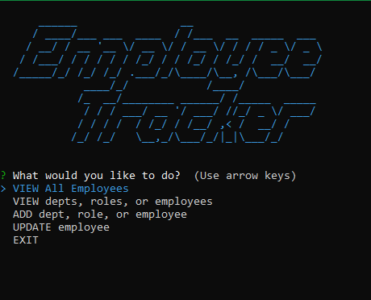

# Employee Tracker
  

  ## Description
  
  Human Resources tool for tracking employees, managers, roles, and departments.
  
  ---
  
  ## Table of Contents
  
  - [Installation](#installation)
  - [Usage](#usage)
  - [Credits](#credits)
  - [Contributing](#contributing)
  - [Tests](#tests)
  - [Questions](#questions)
  - [License](#license)
  
  ---
  
  ## Installation
  
  Fork the repo from the GitHub link listed below. You may need to install [Node.js](https://nodejs.org/en/) if you have not already.

  You may also need to install [MySQL](https://www.mysql.com/).
   
  URL for active webpage: [n/a](n/a)
  
  URL for repository: [https://github.com/tonyschwebach/employee-tracker](https://github.com/tonyschwebach/employee-tracker)
  
  ---
  
  ## Usage

  1. Copy and paste the schema.sql into MySQL and execute. (Seeds data is also provided.) 
  2. Open your terminal and navigate to the correct file path of the employee-tracker directory.
  3. Run `npm install` in the terminal.
  4. Run `node index.js` or `npm start` in the terminal.
  5. Follow the prompts to navigate the app.

  Main Page

  

  [Demo](https://drive.google.com/file/d/1K0inQ5PegLnXs_KIsQEHK7LhLD0dRt78/view) 

  
  
  ---
  
  ## Credits
  
  Georgia Tech Coding Bootcamp staff and Full-Time cohort for their collaboration and guidance.

  Credit to patorjk.com for the ascii art.
  
  
  ---
  
  ## Contributing

  Suggestions for future development:
   - Add more menu options for queries written in the queries.sql file
   - Refactor to modularize the app
   - regex validation for user inputs
  
  ---
  
  ## Tests

  n/a
  
  ---
  
  ## Questions
  
  Please contact [tony.schwebach.developer@gmail.com](mailto:tony.schwebach.developer@gmail.com) or tonyschwebach on [Github](https://github.com/tonyschwebach/).
   
  ---
  
## License

MIT License

Copyright (c) [2021] [tonyschwebach]
    
Permission is hereby granted, free of charge, to any person obtaining a copy
of this software and associated documentation files (the "Software"), to deal
in the Software without restriction, including without limitation the rights
to use, copy, modify, merge, publish, distribute, sublicense, and/or sell
copies of the Software, and to permit persons to whom the Software is
furnished to do so, subject to the following conditions:

The above copyright notice and this permission notice shall be included in all
copies or substantial portions of the Software.

THE SOFTWARE IS PROVIDED "AS IS", WITHOUT WARRANTY OF ANY KIND, EXPRESS OR
IMPLIED, INCLUDING BUT NOT LIMITED TO THE WARRANTIES OF MERCHANTABILITY,
FITNESS FOR A PARTICULAR PURPOSE AND NONINFRINGEMENT. IN NO EVENT SHALL THE
AUTHORS OR COPYRIGHT HOLDERS BE LIABLE FOR ANY CLAIM, DAMAGES OR OTHER
LIABILITY, WHETHER IN AN ACTION OF CONTRACT, TORT OR OTHERWISE, ARISING FROM,
OUT OF OR IN CONNECTION WITH THE SOFTWARE OR THE USE OR OTHER DEALINGS IN THE
SOFTWARE.
  
